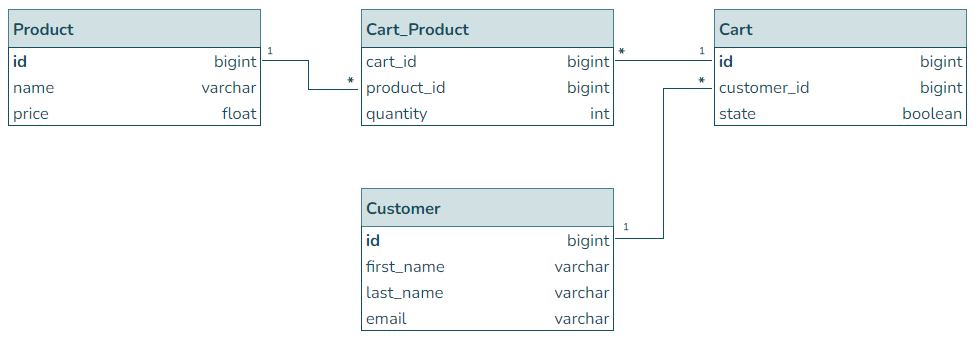

# ecomPlatformCodingChallenge
Java version: 17

Spring Boot version: 2.7.10

Database: H2 relational in-memory database

The H2 console and the Swagger UI can be reached on the default 8080 port

- H2 console location: http://localhost:8080/h2-console

- Swagger UI location: http://localhost:8080/swagger-ui/index.html

## Dependencies

- Spring Web
- Spring Data JPA
- H2 Database
- Lombok
- Spring Boot DevTools
- OpenAPI (for Swagger)
- Spring AOP

## API endpoints

Method | URI | Description
--- | --- | ---
GET | /products | Returns a list of available products
POST | /carts | Creates a new cart with an initial product
POST | /carts/{cartId}/products | Adds a new product to a cart
DELETE | /carts/{cartId}/products/{productId} | Removes a product from a cart
POST | /carts/{cartId}/customer | Adds a new customer to a cart
DELETE | /carts/{cartId}/customer | Removes a customer from a cart
PATCH | /carts/{cartId}/checkout | Changes the checkout state of a cart

## Database schema

